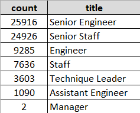
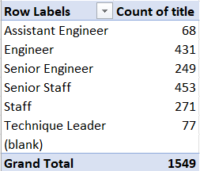

# Pewlett-Hackard-Analysis
## Overview of the analysis
* The purpose of this analysis was to determine the number of retiring employees per title, and identify employees who are eligible to participate in a mentorship program using pgAdmin and SQL.
* The client tasked us with "future-proofing the company by determining how many people will be retiring and, of those employees, who is eligible for a retirement package."
## Results: 
* Task: Determine The Number of Retiring Employees by Title
    *   The largest groups about to retire are employees with the title "Senior Engineer" and "Senior Staff".
    *   These "Senior" title holders make up 70% of the retirees.

* Task: Determine The Employees Eligible for the Mentorship Program
    *   There are 1549 employees that are eligible for the mentorship program
    *   The titles with the largest count available for the mentorship program are "Engineers" and "Senior Staff".
        *   These titles make up a total of 57% of the eligibility for the program.

## Summary: 
* Provide high-level responses to the following questions, then provide two additional queries or tables that may provide more insight into the upcoming "silver tsunami."
How many roles will need to be filled as the "silver tsunami" begins to make an impact?
Are there enough qualified, retirement-ready employees in the departments to mentor the next generation of Pewlett Hackard employees?
* As the "silver tsunami" begins to impact, we will need to begin to prepare to fill 72 458 positions.
   * A company wide restructuring should be considered to consolidate positions to minimize overall cost of hiring. 
* There are currently 33 118 positions being held by employees that will not retire in the new future.
'''
-- select current employees
SELECT ri.emp_no,
	ri.first_name,
	ri.last_name,
	de.to_date
INTO current_emp
FROM retirement_info as ri
LEFT JOIN dept_emp as de
ON ri.emp_no = de.emp_no
WHERE de.to_date = ('9999-01-01');
'''
